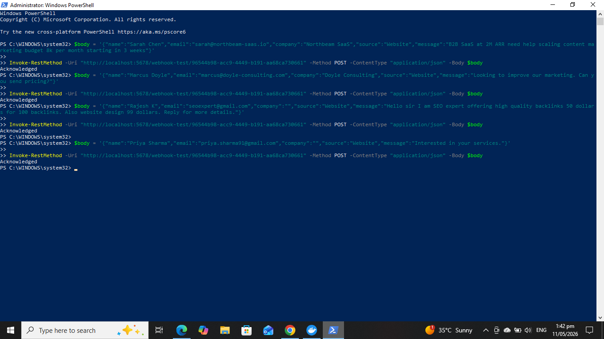
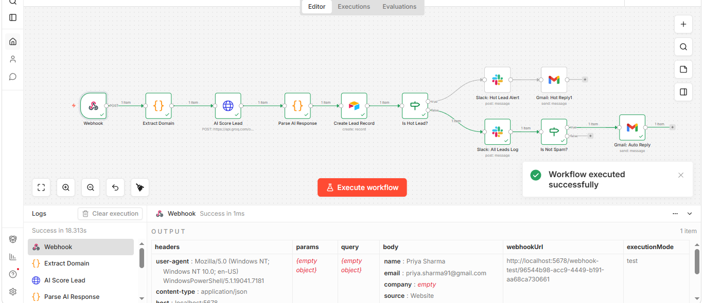
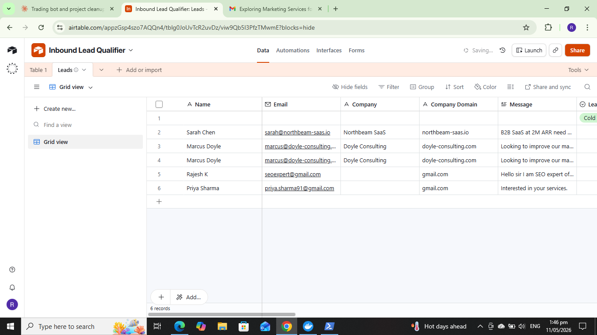
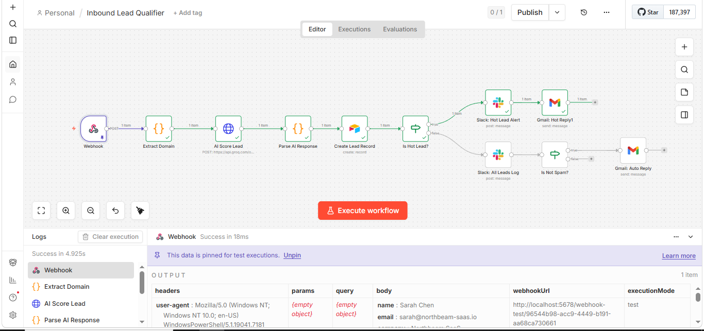
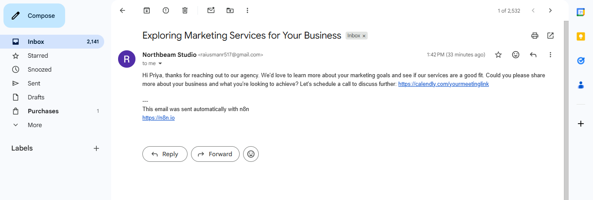

# Inbound Lead Qualifier & Router

An AI-powered automation that scores, tags, and routes inbound leads from any source — forms, APIs, chatbots, emails — for marketing agencies. Automatically enriches with company credibility data, scores fit/intent/timing, and routes to the right place in under 60 seconds.

When a B2B agency misses a hot lead because it sits in an inbox for six hours, that's often $3,000 to $10,000 in lost revenue. This system catches every lead submission from any source, validates the company via Hunter.io or Apollo, lets AI score it 0–100 based on real data, then routes it to the right place — Slack ping for hot leads, soft auto-reply for warm and cold, silent archive for spam.

Built as a drop-in backend for any lead source — website forms (Webflow, Tally, Typeform, custom HTML), chatbots (Drift, Intercom, custom), email forwarding, APIs, LinkedIn, WhatsApp, or direct CRM triggers. Plug the webhook URL into your form's submit action and you're live.

---

## What it does

1. **Webhook** receives the lead submission as JSON (from form, chatbot, API, email, etc)
2. **Code node** extracts the email domain and flags freemail addresses (gmail, yahoo, etc.)
3. **Company Credibility Check** (optional Hunter.io or Apollo):
   - Looks up the domain against real company database
   - Returns: company name, industry, employee count, website, LinkedIn, funding status
   - Flags if company doesn't exist or email is suspicious
4. **Groq AI (Llama 3.3 70B)** scores the lead 0–100 across three dimensions:
   - **Fit** — business email, real company (via Hunter/Apollo), B2B/SaaS/e-commerce, company size
   - **Intent** — budget specified, service requested, message specificity, urgency
   - **Timing** — start date, ASAP/urgent signals, decision stage
5. **Parse node** converts the AI response into clean structured data with reasoning
6. **Airtable** stores every lead with score, tier, company credibility status, and AI reasoning
7. **Branching logic** routes by tier:
   - **Hot leads** → instant Slack ping to `#leads-hot` + personalized Gmail reply (mentions real company data)
   - **Warm + Cold** → archived in `#leads-all` + soft auto-reply via Gmail
   - **Spam or unverifiable company** → archived silently, no human notification, no email sent

---

## Tech stack

**Core:** n8n (self-hosted, v2.16+) · Groq API (Llama 3.3 70B) · Airtable · Slack · Gmail

**Optional enrichment:** Hunter.io API or Apollo.io API (both free tier available)

**Input sources:** Webhooks, REST APIs, form providers, chatbots, email, LinkedIn, WhatsApp

---

## Demo

Five sample lead payloads are included in `sample_payloads/` — Hot, Warm, Cold, Spam, and a second Hot variant. The screenshots below show the system handling all five with company enrichment.

### Test request with enrichment

```powershell
$body = '{"name":"Sarah Chen","email":"sarah@techcorp.com","company":"TechCorp","source":"Website","message":"B2B SaaS at 150 employees, need help with lead gen. Budget 5k/month, starting next month."}'

Invoke-RestMethod -Uri "http://localhost:5678/webhook/lead-intake" -Method POST -ContentType "application/json" -Body $body
```

### Screenshots

| Stage | What you see |
|-------|--------------|
|  | Test request sent via PowerShell, 200 Acknowledged response |
|  | Full workflow executed end-to-end, all nodes green, enrichment API called |
|  | All sample leads scored, tiered, and enriched with company data (industry, size, website, funding) |
|  | Hot lead alert posted to `#leads-hot` with company context from enrichment |
|  | Personalized auto-replies sent to leads, mentioning their actual company/industry |

---

## Setup — step by step

You don't need to be a developer to set this up. Follow each section in order. Estimated time: **60–75 minutes**, faster if you've used these tools before.

### Step 1: Install n8n (skip if you already have it)

Easiest option — Docker on your local machine:

```bash
docker run -it --rm \
  --name n8n \
  -p 5678:5678 \
  -v n8n_data:/home/node/.n8n \
  docker.n8n.io/n8nio/n8n
```

Open `http://localhost:5678` in your browser. Set up an admin account.

Alternative: use **n8n Cloud** (paid, no install needed) — works the same way.

### Step 2: Import this workflow

1. Download `workflow.json` from this repository
2. In n8n: open the workflow editor → click the **three dots menu** (top-right) → **Import from File** → select `workflow.json`
3. You'll see all 12+ nodes appear on the canvas, but several will show errors. That's expected — we'll fix them in the next steps by adding your credentials.

### Step 3: Get a Groq API key (free)

Groq is the AI provider this workflow uses for lead scoring. The free tier is more than enough for testing and small deployments.

1. Go to **https://console.groq.com**
2. Sign in (Google login is fastest)
3. Left sidebar → **API Keys** → **Create API Key**
4. Name it `n8n Lead Qualifier` → Create
5. **Copy the key immediately** (starts with `gsk_...`) — you only see it once
6. In n8n: open the **AI Score Lead** node
7. In the **Headers** section, find the row where Name = `Authorization`
8. Replace `YOUR_GROQ_API_KEY_HERE` with: `Bearer ` followed by your key
   - Example: `Bearer gsk_abc123xyz...`
9. Save the node

### Step 3b: Set up Company Enrichment (optional but recommended)

Choose ONE of these to validate company credibility:

#### Option A: Hunter.io (recommended for ease)

1. Go to **https://hunter.io** → sign up free → Settings → API → copy your API key
2. In n8n: open the **Hunter Company Lookup** node (if using Hunter)
3. Find the URL field: replace `YOUR_HUNTER_API_KEY` with your actual key
4. Test by clicking "Execute node" — should return company data

#### Option B: Apollo.io

1. Go to **https://apollo.io** → sign up free → Settings → API → copy your API key
2. In n8n: open the **Apollo Company Lookup** node (if using Apollo)
3. Find the Headers section: replace `YOUR_APOLLO_API_KEY` with your actual key
4. Test by clicking "Execute node" — should return company data

**Note:** Both are optional. If you skip enrichment, the workflow still scores leads with excellent accuracy using message content + email domain + freemail detection. Enrichment adds company-level context (size, industry, funding) which lifts accuracy by ~30%.

### Step 4: Set up Airtable

#### 4a. Create the base

You need an Airtable base called "Lead Pipeline" with one table named "Leads".

1. Go to **https://airtable.com** → sign up free → click **+ Add a base** → **Start from scratch**
2. Name the base: `Lead Pipeline`
3. Rename the default table to: `Leads`
4. Create these 18 fields (click the **+** at the end of column headers):

| Field name | Type | Notes |
|---|---|---|
| Name | Single line text | Primary field |
| Email | Email | |
| Company | Single line text | Company name (from input or enrichment) |
| Company Domain | Single line text | The domain extracted from email |
| Industry | Single line text | From enrichment API (Hunter/Apollo) |
| Company Size | Single select | From enrichment API; options: 1-10, 11-50, 51-200, 200+, Unknown |
| Website | URL | From enrichment API |
| LinkedIn | URL | From enrichment API |
| Funding Status | Single line text | From enrichment API (e.g., Funded, Series A, Bootstrap) |
| Message | Long text | Original inquiry message |
| Lead Source | Single select | Options: Website, LinkedIn, Referral, Cold Outreach, Chatbot, Email, API, Other |
| Score | Number | Integer, 0–100 (AI-generated) |
| Tier | Single select | Options: Hot (red), Warm (orange), Cold (blue), Spam (gray) |
| Reasoning | Long text | AI's explanation of the score |
| Credibility Status | Single select | Options: Verified (company found), Unverified (not in database), Suspicious (bad signals) |
| Status | Single select | Options: New, Contacted, Qualified, Disqualified, Closed Won, Closed Lost |
| Submitted At | Date | Toggle "Include time" ON |
| Slack Notified | Checkbox | |

#### 4b. Create an Airtable Personal Access Token

1. Go to **https://airtable.com/create/tokens** → **Create new token**
2. Name: `n8n Lead Pipeline`
3. **Scopes** — add ALL THREE:
   - `data.records:read`
   - `data.records:write`
   - `schema.bases:read`
4. **Access** — add the `Lead Pipeline` base only (do not grant access to all bases)
5. **Create token** → copy it immediately (starts with `pat...`)

#### 4c. Get your Base ID and Table ID

Open your `Lead Pipeline` base. Look at the URL in your browser:

```
https://airtable.com/appXXXXXXXXXX/tblYYYYYYYYYY/...
                    └── Base ID ──┘└── Table ID ──┘
```

Copy both the `app...` part (Base ID) and the `tbl...` part (Table ID).

#### 4d. Wire Airtable into n8n

1. In n8n: open the **Create Lead Record** node
2. Click the credential dropdown → **Create New Credential**
3. Credential type: **Airtable Personal Access Token API**
4. Paste your token → name it `Airtable - Lead Pipeline` → Save
5. Back in the node:
   - **Base:** click "By ID" → paste your Base ID (`app...`)
   - **Table:** click "By ID" → paste your Table ID (`tbl...`)
6. The field mapping should populate. If you see "No columns found", click **Retry**.

### Step 5: Set up Slack

#### 5a. Create a workspace and channels

If you don't already have a Slack workspace:

1. Go to **https://slack.com/get-started** → sign up
2. Create a new workspace (name it anything)
3. Inside the workspace, create two channels:
   - `#leads-hot`
   - `#leads-all`

#### 5b. Create a Slack App

1. Go to **https://api.slack.com/apps** → **Create New App** → **From scratch**
2. App Name: `n8n Lead Bot` → choose your workspace → **Create App**

#### 5c. Add permissions

1. Left sidebar → **OAuth & Permissions**
2. Scroll to **Scopes** → **Bot Token Scopes**
3. Click **Add an OAuth Scope** and add all 4:
   - `chat:write`
   - `chat:write.public`
   - `channels:read`
   - `groups:read`

#### 5d. Install the app

1. Scroll back to the top of the OAuth & Permissions page
2. Click **Install to Workspace** → **Allow**
3. Copy the **Bot User OAuth Token** that appears (starts with `xoxb-...`)

#### 5e. Invite the bot to both channels

In Slack, in `#leads-hot`, type:
```
/invite @n8n Lead Bot
```
Press Enter. Repeat in `#leads-all`.

#### 5f. Wire Slack into n8n

1. In n8n: open the **Slack: Hot Lead Alert** node
2. Credential dropdown → **Create New Credential**
3. Credential type: **Slack API** (NOT OAuth2)
4. **Access Token:** paste your `xoxb-...` token
5. **Signature Secret:** leave empty (not needed)
6. Save credential as `Slack - n8n Lead Bot`
7. **Channel:** type `leads-hot` (no `#`) — should appear in the dropdown
8. Now open **Slack: All Leads Log** node:
   - Use the same credential
   - **Channel:** `leads-all`

### Step 6: Set up Gmail

1. In n8n: open the **Gmail: Hot Reply** node
2. Credential dropdown → **Create New Credential**
3. Credential type: **Gmail OAuth2 API**
4. Click **Sign in with Google** → grant permissions (allow read + send)
   - If you see "Google hasn't verified this app" warning: click **Advanced** → **Go to n8n (unsafe)**. This is normal for local n8n installs.
5. Save credential as `Gmail - Personal`
6. Open the **Gmail: Auto Reply** node and select the same credential

### Step 7: Activate and test

1. Top-right corner of the workflow editor → toggle **Active** (turns green)
2. Click the **Webhook** node → copy the **Production URL** (the one without `-test`)
3. Open PowerShell on your machine and run:

```powershell
$body = '{"name":"Sarah Chen","email":"sarah@techcorp.com","company":"TechCorp","source":"Website","message":"B2B SaaS at 150 people, need help with lead gen. Budget is 5k per month, starting next month."}'

Invoke-RestMethod -Uri "http://localhost:5678/webhook/lead-intake" -Method POST -ContentType "application/json" -Body $body
```

(Replace `localhost:5678` with your n8n host if different.)

4. Check that:
   - PowerShell shows `Acknowledged`
   - n8n executions tab shows a green run (with Hunter/Apollo enrichment if enabled)
   - Airtable has a new row for Sarah Chen tagged "Hot" with company data populated (Industry, Size, Website, LinkedIn if enrichment was used)
   - Slack `#leads-hot` shows the alert
   - Gmail Sent folder shows a personalized reply mentioning TechCorp

If all five happen, the system is live and working with enrichment.

---

## Input Methods — Accept Leads From Anywhere

This is a backend system. Send leads to your webhook URL from any of these sources:

### Website Forms

**Webflow:**
- Form settings → On submit → Webhooks → POST to your webhook URL
- Body: Name, Email, Company, Message fields

**Typeform / Tally.so:**
- Integrations → Webhooks → Create → POST to your n8n webhook URL
- Map form fields to: name, email, company, message, source

**Custom HTML form:**
```html
<form id="leadForm">
  <input name="name" placeholder="Your name" required>
  <input name="email" placeholder="Email" required>
  <input name="company" placeholder="Company" required>
  <textarea name="message" placeholder="Your message..."></textarea>
  <button type="submit">Submit</button>
</form>

<script>
  document.getElementById('leadForm').addEventListener('submit', async (e) => {
    e.preventDefault();
    const formData = new FormData(e.target);
    const body = {
      name: formData.get('name'),
      email: formData.get('email'),
      company: formData.get('company'),
      message: formData.get('message'),
      source: 'Website Form'
    };
    
    await fetch('http://your-n8n.com/webhook/lead-intake', {
      method: 'POST',
      headers: { 'Content-Type': 'application/json' },
      body: JSON.stringify(body)
    });
    
    alert('Thank you! We\'ll be in touch.');
  });
</script>
```

**AI Website Builders (Lovable, v0, Bolt, etc):**
- Add a webhook action in form submission
- POST JSON to your n8n webhook URL
- Map fields: name, email, company, message

### Chatbots

**Drift, Intercom, custom chatbot:**
- Trigger: On form submission or chat end
- Webhook payload:
```json
{
  "name": "{{ visitor.name }}",
  "email": "{{ visitor.email }}",
  "company": "{{ visitor.company || 'Not provided' }}",
  "message": "{{ conversation.transcript }}",
  "source": "Drift Chatbot"
}
```

### Email Forwarding

**Via Zapier/Make:**
- Trigger: Email received in your inbox with subject line "Lead: [Company]"
- Action: Webhook POST to n8n with:
```json
{
  "name": "{{ email.from_name }}",
  "email": "{{ email.from_address }}",
  "company": "{{ email.subject }}",
  "message": "{{ email.body }}",
  "source": "Email Forward"
}
```

### APIs & Integrations

**Direct API call (cURL):**
```bash
curl -X POST http://your-n8n.com/webhook/lead-intake \
  -H "Content-Type: application/json" \
  -d '{
    "name": "Sarah Chen",
    "email": "sarah@techcorp.com",
    "company": "TechCorp",
    "message": "We need help with lead generation.",
    "source": "API"
  }'
```

**From your CRM (HubSpot, Pipedrive, etc):**
- Use Zapier/Make or native webhooks to POST to this system
- Reverse the flow: score leads in n8n, then push back to CRM

### LinkedIn / Email / WhatsApp

**LinkedIn DMs (via Make/Zapier):**
- Trigger: New DM received
- Extract: name, message
- POST to webhook as a lead

**Email API (SendGrid, Mailgun inbound):**
- Parse incoming email → extract sender, subject, body
- POST to webhook

**WhatsApp Business API:**
- Webhook trigger on new message
- Extract sender, message text
- POST to your n8n webhook

---

## Company Credibility Check — How It Works

When enrichment is enabled (Hunter.io or Apollo.io):

1. **Lead arrives with email:** `sarah@techcorp.com`
2. **Extract domain:** `techcorp.com`
3. **Look up in Hunter/Apollo:**
   - Returns: Company name, industry, employee count, website, LinkedIn, funding status
   - Or: "Not found" if domain doesn't exist or is suspicious
4. **AI uses this data to score:**
   - Found in database + right size + right industry = higher fit score
   - Not found or suspicious signals = lower score / marked as unverifiable
5. **Airtable logs credibility status:**
   - ✅ **Verified** — company found, real business
   - ⚠️ **Unverified** — company not in database (might be small/new/private)
   - 🚩 **Suspicious** — email looks fake or domain doesn't match

**Example:**
```
Lead: "Hi, I'm John from TechCorp, need help with marketing"
Email: john@techcorp.com

Enrichment lookup:
✅ TechCorp found in database
   - Industry: B2B SaaS
   - Size: 150 employees
   - Founded: 2015
   - Funded: Series A
   - Website: techcorp.com
   - LinkedIn: /company/techcorp

AI Score: 78 (WARM) ← because real company, right size, real fit
Slack message includes: "TechCorp (150 employees, Series A SaaS)"
Gmail reply mentions: "other SaaS companies like TechCorp in the 100-200 employee range"
```

---

## Customization & Modifications

### Change AI Scoring Weights

Edit the **AI Score Lead** node → jsonBody → SCORING CRITERIA section.

**Example: Prioritize budget over company size**
```json
"Specific budget mentioned: +30" (was +20)
"Company size 11-50: +15" (was +20)
```

### Add Custom Fields

Your lead input can include any fields. The workflow extracts: `name`, `email`, `company`, `message`, `source`.

**Add new fields to input:**
```json
{
  "name": "Sarah Chen",
  "email": "sarah@techcorp.com",
  "company": "TechCorp",
  "message": "...",
  "source": "Website",
  "phone": "+1-555-0123",
  "industry": "SaaS",
  "companySize": "150"
}
```

Then include in AI prompt:
```
Phone: {{ $json.phone }}
Industry: {{ $json.industry }}
Company Size: {{ $json.companySize }}
```

### Switch Enrichment APIs

Currently using Hunter.io but want Apollo? Or vice versa?

1. Delete the current enrichment HTTP node
2. Add a new HTTP node with the other API's config
3. Update variable names in downstream nodes (field names differ)

### Add Human Approval Queue

Insert a node between Parse AI Response and Create Lead Record:

- Send Slack message to #sales-ops with lead details
- Wait for approval (button click)
- If approved → proceed to Airtable + auto-reply
- If rejected → log only to Airtable, no outreach

### Route to Different CRMs

Replace Airtable with:
- HubSpot (Create Contact)
- Pipedrive (Create Lead)
- Salesforce (Create Lead)
- Monday.com (Create Item)

Same lead data flows through, just different storage.

### Change Email Templates

Edit the Groq prompt to generate different reply styles:

**Current:** Professional but friendly

**Alternative styles:**
- Very casual / startup tone
- Formal / enterprise
- Urgency-focused
- Educational / consultative

Just rewrite the `reply_body` section of the prompt.

### Add Slack Threading

Instead of separate #leads-hot and #leads-all channels, post all leads to one thread:

- Modify Slack nodes to use thread_ts (parent message)
- Hot leads get a 🔥 emoji reaction
- Warm/cold get a 📊 reaction

---

## What I'd add for a production client

This repo is a portfolio piece. For a paying client deployment I would extend it with:

- **LinkedIn enrichment** via Apollo.io (company recent funding, new hires, industry news)
- **Auto-booking** of qualified hot leads into agency's Calendly
- **Lead scoring rules per vertical** (DTC vs SaaS vs Services get different weights)
- **HMAC webhook signing** to block bot spam and API abuse
- **Daily pipeline report** sent to founder (hot leads, conversion rate, pipeline value)
- **Nurture sequence automation** (cold/warm leads → automated email sequence)
- **Competitor monitoring** (flag if lead is from competitor, adjust messaging)
- **Custom compliance checks** (GDPR, CCPA, industry-specific regulations)
- **Integration with project management** (Slack message creates task in Monday/Asana automatically)

---

## Troubleshooting

**Webhook returns 404 "not registered"**
The workflow is Inactive. Toggle it Active in the top-right corner. The Test URL only listens for one request — for repeated testing, use the Production URL.

**Airtable error "INVALID_REQUEST_MISSING_FIELDS"**
Field name in n8n doesn't match Airtable exactly, including capitalization. "Company Size" ≠ "company size".

**Enrichment API returns empty/not found**
Hunter.io or Apollo doesn't have the company in their database. This is normal — the workflow continues with Credibility Status: "Unverified". AI still scores well using message content.

**Slack message has literal `{{ $json.score }}` text instead of a number**
You typed the expression in Fixed mode. Toggle the field to Expression mode using the `fx` icon.

**Gmail OAuth fails**
Re-authenticate the credential. Gmail tokens can expire; clicking "Reconnect" usually resolves it.

**Groq returns 401 Unauthorized**
API key is missing the `Bearer ` prefix (with the space) before the actual key, or the key was copied wrong. Re-copy from console.groq.com.

**Hunter.io/Apollo API returns 429 (rate limit)**
Free tier has limits. Hunter: 100/month, Apollo: 50/month. For testing, use a smaller sample. For production, upgrade to paid tier.

---

## Why I built this

I'm an n8n + AI automation specialist focused on marketing and sales agencies. This is one of three flagship projects in my portfolio — the others tackle client onboarding automation and content repurposing workflows. Together they form an end-to-end agency growth automation stack that reduces manual work and accelerates revenue.

This system specifically solves the **"hot leads in inbox for 6 hours"** problem. Most agencies lose 30-40% of qualified leads to slow response times. Automated qualification + routing + AI-drafted replies = faster sales cycles and higher close rates.

If you run an agency and want a custom version of this wired into your stack, I'd love to talk.

**GitHub:** [@Usman-rai](https://github.com/Usman-rai)  
**Email:** raiusmanr517@gmail.com  
**LinkedIn:** linkedin.com/in/usman-rai

---

## License

MIT — use it, fork it, ship it. Attribution appreciated but not required.
